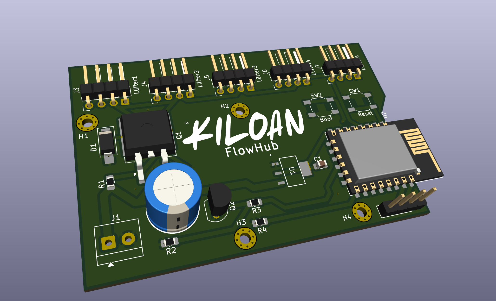
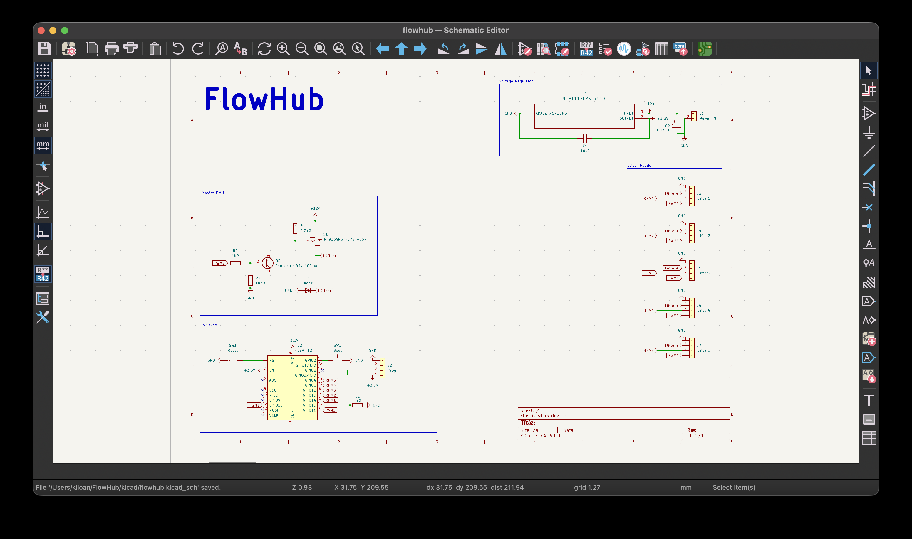
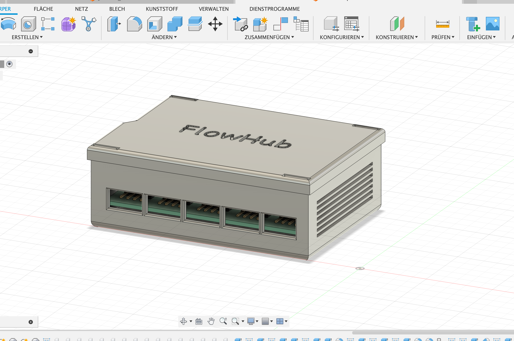

  <h1 align="center">FlowHub V1</h1>

  

  

  <a href="https://blueprint.hackclub.com/">
    </img>
  </a>
  

  <h1></h1>
  

    ESP8266-based PC fan controller for Racks.
  

This work is licensed under the
[MIT License](https://mit-license.org).

## Table of Contents

- [About](#about)
- [Pictures](#pictures)
- [Bill of Materials](#bill-of-materials)

# About

So I had the idea to develop a central control unit for PC fans, more precisely, one for a mobile rack that also houses computers. Then I could control the fan speeds independently of the individual computers. As I said, I needed this for my rack, which I used for learning and experimenting, so I built a simple PCB with a case for this purpose.

# Pictures

# Bill of Materials

<strong>Show Bill Of Materials(BOM) ----></strong>

|Designator|Footprint                                  |Quantity|Value               |LCSC Part #|
|----------|-------------------------------------------|--------|--------------------|-----------|
|C1        |0805                                       |1       |10uF                |C2897295   |
|C2        |CP_Radial_D10.0mm_P5.00mm                  |1       |1000uF              |C10750     |
|D1        |D_SMA_Handsoldering                        |1       |Diode               |C22452     |
|J1        |TerminalBlock_4Ucon_1x02_P3.50mm_Horizontal|1       |Power IN            |C695629    |
|J2        |PinHeader_1x04_P2.54mm_Vertical            |1       |Prog                |C52016392  |
|J3        |PinHeader_1x04_P2.54mm_pclüfter            |1       |Lüfter1             |C722747    |
|J4        |PinHeader_1x04_P2.54mm_pclüfter            |1       |Lüfter2             |C722747    |
|J5        |PinHeader_1x04_P2.54mm_pclüfter            |1       |Lüfter3             |C722747    |
|J6        |PinHeader_1x04_P2.54mm_pclüfter            |1       |Lüfter4             |C722747    |
|J7        |PinHeader_1x04_P2.54mm_pclüfter            |1       |Lüfter5             |C722747    |
|Q1        |TO-263-2                                   |1       |IRF9Z34NSTRLPBF-JSM |C21714355  |
|Q2        |TO-92                                      |1       |Transistor 45V 100mA|C900800    |
|R1        |0805                                       |1       |2.2kΩ               |C17520     |
|R2        |0805                                       |1       |10kΩ                |C84376     |
|R3, R4    |0805                                       |2       |1kΩ                 |C95781     |
|SW1       |SW_SPST_SKQG_WithStem                      |1       |Reset               |C116647    |
|SW2       |SW_SPST_SKQG_WithStem                      |1       |Boot                |C116647    |
|U1        |SOT223-3_ONS                               |1       |NCP1117LPST33T3G    |C146799    |
|U2        |ESP-12E                                    |1       |ESP-12F             |C82891     |
|Quote from LCSC: $21.43 Quote from JLCPCB: $10,96       |                                           |        |                    |           |

